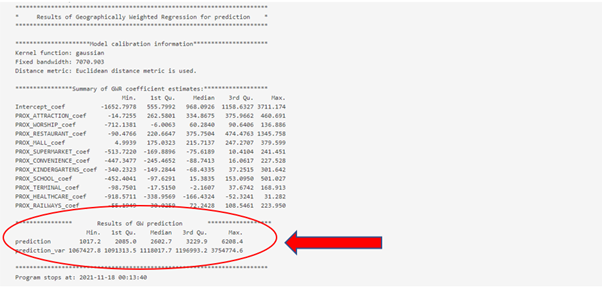

```{r setup, include=FALSE}
knitr::opts_chunk$set(echo = FALSE)
```

# Data

## Requirements

1. The file has to be of **CSV** file type
2. The file has to contain columns of either pair of the geometry as indicated below:
    * **X** and **Y** columns in metres and must be in WGS84, CRS = 4326 (Example: X = -3627128.977, Y = 692083.5103)
    * **LAT** and **LONG**  columns in decimal degrees (Example:  LAT = 1.322126589, LONG = 103.8597576)
3. Dependent and independent variables in numerical format (Example: PROX_ATTRACTION, POSITIF) 

# Data Import

* **Data Import will only be available in EDA tab** 
* **Data should not be too large (Maximum: 1000 rows)**
* **Large data should expect a longer loading time**

```{r echo=FALSE, fig.align='center',out.width='100%'}

```

1. Click "Browse..."

```{r echo=FALSE, fig.align='center',out.width='100%'}

```

2. Select the csv file

```{r echo=FALSE, fig.align='center',out.width='100%'}

```

3. Input the CRS of your dataset's country (Example: SG: 3414, Jakarta: 23845)
4. Select "Update CRS" (To list out the dependent and independent variables available.)

# EDA

```{r echo=FALSE, fig.align='center',out.width='100%'}

```

1. Select a independent variable or dependent variables to visualise on the choropleth map and histogram
2. Select the classification method to be used on the choropleth map (e.g. jenks, equal) Note that the method “fixed” is for categorical variable
3. For histogram, select the number of bins to group your data
4. Choose the colour you like for the histogram
5. Click on “Run” button to show the visualisation 
6. Toggle between the tabs to see the either the choropleth map, the histogram or the data table

## Choropleth Map

```{r echo=FALSE, fig.align='center',out.width='100%'}

```

For numerical variables, the darker the color of a spatial point the higher the value of the selected variable, while the lighter the color of a spatial point indicating lower value of the selected variable.

In this example, the regions that are closer to attraction places can be seen to be clustered around central Jakarta, while the regions near the border are further away from attraction places

## Histogram

```{r echo=FALSE, fig.align='center',out.width='100%'}
knitr::include_graphics("userGuideImage/EDA_3.png")
```

Histogram is used to see the distribution of the data. The number of bins is to help group the data according to the values. Additionally, histogram is a efficient way to look at the skewness of the data distribution.

In this example, PROX_ATTRACTION is slightly right skewed, however, no action is required for our application to work.

# GWR

```{r echo=FALSE, fig.align='center',out.width='100%'}

```

1. Select dependent variable (**Note: The correct dependent variable must be selected if not the system will have error**)
2. Select 1 or more independent variables to analyze the relationships (**Note: Select only numeric variables, do not select geometry and select at least 2 independent variables if a correlation analysis is desired**)

```{r echo=FALSE, fig.align='center',out.width='100%'}

```

**Note that all parameters for “Correlation Plot” and “Model” have a default value as shown above. Not changing the selection will run the correlation and model analysis based on the selected parameters.**

## Correlation Plot (Step 1 to 3)

1. Select Order (AOE, FPC, hclust. alphabet)
2. Select Method (circle, square, ellipse, number, shade, color, pie)
3. Select Type (full, upper, lower)

If there are no changes to model parameters, click “Run” (Step 8)

## Model (Step 4 to 8)

4. Select Bandwidth (Fixed, Adaptive)
5. Select Approach (Cross Validation(CV), Akaike Information Criterion (AIC))
6. Select Kernel (Gaussian, Exponential, Bisquare, Tricube, Boxcar)
7. Select Distance metric (Euclidean, Great Circle)
8. Apply the changes in parameters to the model

## Formula Tab

```{r echo=FALSE, fig.align='center',out.width='100%'}

```

The formula tab shows the Multiple Linear Regression Formula based on the dependent and independent variables selected.

In this example, The formula is:
POSITIF ~ PROX_ATTRACTION + PROX_WORSHIP + PROX_RESTAURANT

## Correlation Plot Tab

```{r echo=FALSE, fig.align='center',out.width='100%'}

```

In this tab, the correlation between selected dependent variables are shown with the diagonal always equating to 1 as a variable will always be correlated with itself. From the graph, the darker the colors are, the more the variables are correlated regardless of whether it is positive or negative.

In this example, the correlation plots shows the correlation coefficient between the 3 variables, PROX_ATTRACTION, PROX_WORSHIP, PROX_RESTAURANT. PROX_ATTRACTION can be inferred to be more correlated to PROX_RESTAURANT than with PROX_WORSHIP.

## Summary Tab

```{r echo=FALSE, fig.align='center',out.width='100%'}
knitr::include_graphics("userGuideImage/GWR_5.png")
```

In the Summary Tab, the statistical summary of the base model is shown. Some of which includes: Min, Median, Max, Statistical significance of variables in the model, the R-square value of the model. Based on the calculated p-value of each selected dependent variable, users can decide which variables to keep in the model.

In this example, we can interpret the multicollinearity function to be as such:
	POSITIF = 1822.98 + 185.89 *  PROX_ATTRACTION + 69.32 * PROX_WORSHIP + 362.23 * PROX_RESTAURANT

The R-squared refers to the percentage that the regression model is able to explain. In this case, the R-squared is 0.1944 and it means that the multiple regression model built is able to explain about 19% of the number of POSITIF COVID-19 cases.

The model p-value tells us if the multiple linear regression model is a good estimator of the dependent variable. P-value lower than the significance level means multiple linear regression model is a good estimator of the dependent variable. P-value higher than the significance level means that the mean is a good estimator of the dependent variable. 

The p-value of the above model is much smaller than 0.05, and hence we will reject the null hypothesis that mean is a good estimator of POSITIF. We can infer that the multiple linear regression model is a good estimator of POSITIF cases.

Coefficients section shows the p-values of the estimates of the Intercept and the independent variables. Variables with p-value less than the significance level (can look at the asterick depending on the significance level determined by the user) means that they are good parameter estimates, which should be kept. On the other hand, variables with p-value above significance level (can look at the asterick depending on the significance level determined by the user) means they are not statistically significant and should be removed from the model. 

The above shows that PROX_ATTRACTION and PROX_RESTAURANT are statistically significant and should be kept.

## Multicollinearity Tab

```{r echo=FALSE, fig.align='center',out.width='100%'}

```

The multicollinearity tab shows the VIF value of each independent variable

Independent variables with VIF more than 10 should be removed because there are signs of multicollinearity. In the example above, there is no sign of multicollinearity among the independent variables.

## Linearity Tab

```{r echo=FALSE, fig.align='center',out.width='100%'}

```

The Linearity tab shows a plot of the model’s scaled residual centering around a zero line. A scatter plot clustering near the zero line indicates close approximation to linearity function.

In this example, we can see that most of the points are close to the zero line with a minority scattering across the lower and upper extremes of the graph, the model can therefore be considered to be approximately linear.

## Normality

```{r echo=FALSE, fig.align='center',out.width='100%'}

```

The Normality tab shows the distribution of the model’s residual. It is desired to have the curve to closely resemble a normal curve as an indication for normality approximation.

In this example, we can see some resemblance of a normal curve, even though the curve is considered flat. This means that the model fulfils the normality assumption.

## Base Model’s Performance

```{r echo=FALSE, fig.align='center',out.width='100%'}

```

In the Base Model’s Performance tab, the statistical summary of the global regression model and the GWR model are provided, as shown below.

```{r echo=FALSE, fig.align='center',out.width='100%'}

```

```{r echo=FALSE, fig.align='center',out.width='100%'}

```


Based on the summary given in this example, we can see that the global regression model’s R-squared value is extremely low as compared to that of the GWR model. As R-squared value indicates how much of the data can be explained by the model, it may be worth considering to include more variables for better explainability of the model.

## Visualization

```{r echo=FALSE, fig.align='center',out.width='100%'}

```

In this Visualization tab, the distribution of the local_R2 score is shown geographically, with darker shades indicating higher local_R2, thus better explainability of the model, while lighter shades indicate poorer explainability.

In this example, we can see that there are signs of clustering based on the local R-squared values, this may indicate that in certain areas, the dependent variable tend to have stronger relations to the selected independent variable

## Data Table

```{r echo=FALSE, fig.align='center',out.width='100%'}

```

The data table tab shows the data of the selected dependent and independent variables. 

# Prediction

```{r echo=FALSE, fig.align='center',out.width='100%'}

```
```{r echo=FALSE, fig.align='center',out.width='100%'}

```

1. Select Dependent Variable (**Note: The correct dependent variable must be selected if not the system will have error**)
2. Select Two or More Independent Variables (**Note: Select only numeric variables and do not select geometry**)
3. Select Bandwidth (Fixed/Adaptive)
4. Select Approach (Cross Validation (CV) /Akaike Information Criterion (AIC))
5. Select Kernel (Gaussian/Exponential/Bisquare/Tricube/Boxcar)
6. Select Distance metric (Euclidean/Great Circle)
7. Check/Uncheck data table to show/unshow data table
8. Select “Run” button to see prediction

## Formula Tab

```{r echo=FALSE, fig.align='center',out.width='100%'}

```

The formula tab shows the Multiple Linear Regression Formula based on the dependent and independent variables input.

In this example, The formula is:
POSITIF ~ PROX_ATTRACTION + PROX_WORSHIP + PROX_RESTAURANT + PROX_MALL + PROX_SUPERMARKET + PROX_CONVENIENCE + PROX_KINDERGARTENS + PROX_SCHOOL + PROX_TERMINAL + PROX_HEALTHCARE + PROX_RAILWAYS

## Summary Tab

```{r echo=FALSE, fig.align='center',out.width='100%'}

```

The summary tab shows the summary of the linear regression model of the formula.

With the estimate of each coefficient we are able to formulate the linear regression formula. The summary shows that the number of POSITIF COVID-19 cases can be explained by using the formula:

POSITIF = 1861.21 + 242.39(PROX_ATTRACTION) + 36.22(PROX_WORSHIP) + 405.32(PROX_RESTAURANT) + 132.49(PROX_MALL) - 11.06(PROX_SUPERMARKET) - 30.83(PROX_CONVENIENCE) - 183.96(PROX_KINDERGARTENS) + 45.30(PROX_SCHOOL) - 13.63(PROX_TERMINAL) - 236.01(PROX_HEALTHCARE) + 57.90(PROX_RAILWAYS)

The R-squared refers to the percentage that the regression model is able to explain. In this case, the R-squared is 0.2622 and it means that the multiple regression model built is able to explain about 26% of the number of POSITIF COVID-19 cases.

The model p-value tells us if the multiple linear regression model is a good estimator of the dependent variable. P-value lower than the significance level means multiple linear regression model is a good estimator of the dependent variable. P-value higher than the significance level means that the mean is a good estimator of the dependent variable. 

The p-value of the above model is much smaller than 0.05, and hence we will reject the null hypothesis that mean is a good estimator of POSITIF. We can infer that the multiple linear regression model is a good estimator of POSITIF cases.

Coefficients section shows the p-values of the estimates of the Intercept and the independent variables. Variables with p-value less than the significance level (can look at the asterick depending on the significance level determined by the user) means that they are good parameter estimates, which should be kept. On the other hand, variables with p-value above significance level (can look at the asterick depending on the significance level determined by the user) means they are not statistically significant and should be removed from the model. 

The above shows that PROX_ATTRACTION, PROX_RESTAURANT, PROX_MALL, PROX_HEALTHCARE and PROX_RAILWAYS are statistically significant and should be kept.


## Prediction Model’s Performance Tab

```{r echo=FALSE, fig.align='center',out.width='100%'}

```

```{r echo=FALSE, fig.align='center',out.width='100%'}

```

The prediction tab shows the result of GW prediction with the model. It shows the min, median and max of the predicted values. 

From the example, the min predicted POSITIF COVID-19 case is 1017.2, median predicted POSITIF COVID-19 case is 2602.7, and max predicted POSITIF COVID-19 case is 6208.4.

## Visualization Tab

```{r echo=FALSE, fig.align='center',out.width='100%'}

```

The visualization tab shows an interactive map of the predicted value geographically. Darker shade dot means a high prediction value while lighter shade dot means a low prediction value.

The above example shows the predicted POSITIF COVID-19 cases geographically in Jakarta. Region with darker shade dot means a high number of predicted POSITIF COVID-19 cases while region with lighter shade dot means a low number of predicted POSITIF COVID-19 cases.

## Data Table

```{r echo=FALSE, fig.align='center',out.width='100%'}

```

The data table tab shows the data of the selected dependent and independent variables. 
